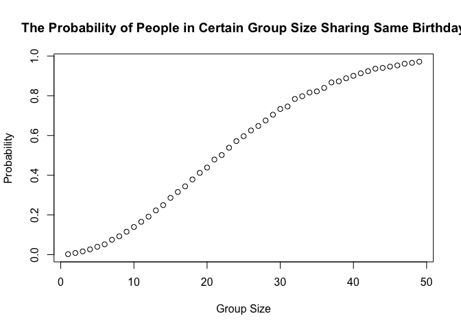
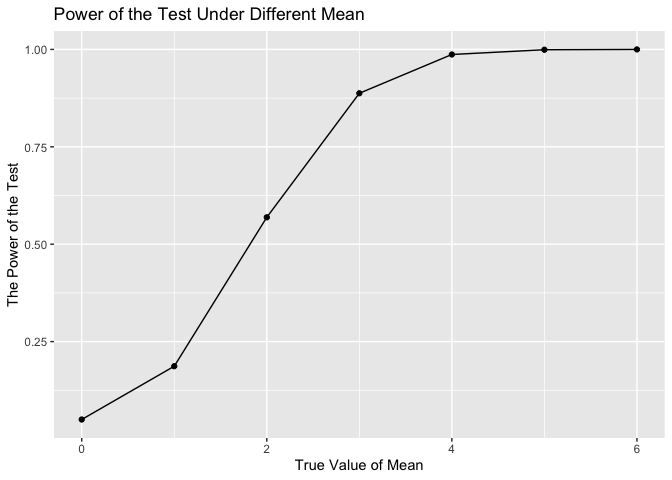
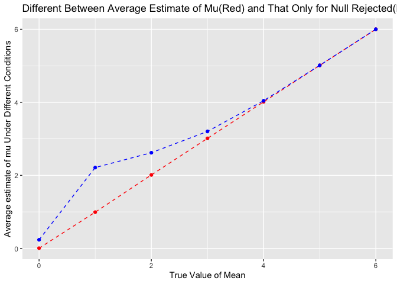
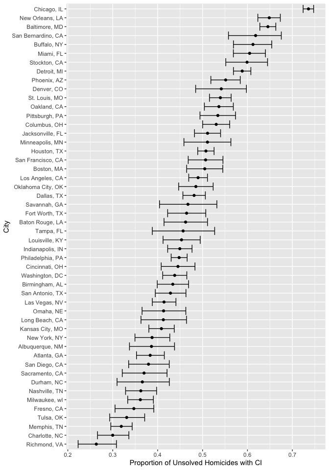

p8105_hw5_hn2453
================

``` r
library(broom)
library(tidyverse)
```

    ## ── Attaching core tidyverse packages ──────────────────────── tidyverse 2.0.0 ──
    ## ✔ dplyr     1.1.4     ✔ readr     2.1.5
    ## ✔ forcats   1.0.0     ✔ stringr   1.5.1
    ## ✔ ggplot2   3.5.1     ✔ tibble    3.2.1
    ## ✔ lubridate 1.9.3     ✔ tidyr     1.3.1
    ## ✔ purrr     1.0.2     
    ## ── Conflicts ────────────────────────────────────────── tidyverse_conflicts() ──
    ## ✖ dplyr::filter() masks stats::filter()
    ## ✖ dplyr::lag()    masks stats::lag()
    ## ℹ Use the conflicted package (<http://conflicted.r-lib.org/>) to force all conflicts to become errors

``` r
library(ggplot2)
library(readr)
library(dplyr)
library(purrr)
set.seed(1)
```

## Problem 1

Write the function to check whether there are duplicate birthdays in the
group with fixed group size.

``` r
group_size = 2:50

birthdays = 1:365

dup_birthday = function(n){
  
  assign_birthday = sample(birthdays, n, replace = TRUE)

  return(anyDuplicated(assign_birthday)!=0)
  
}
```

Run previous function 10000 times for each group size between 2 and 50

``` r
simulations = 10000

prob = array(2:50, dim = c(49))
for(n in group_size){
  count = 0
for(i in 1:simulations){
  if(dup_birthday(n)){
    count = count + 1
  }
  
}
  prob[n-1] = count/simulations
}

prob
```

    ##  [1] 0.0024 0.0085 0.0167 0.0267 0.0399 0.0521 0.0751 0.0925 0.1158 0.1394
    ## [11] 0.1655 0.1916 0.2229 0.2496 0.2861 0.3157 0.3439 0.3788 0.4120 0.4387
    ## [21] 0.4792 0.5016 0.5386 0.5718 0.5967 0.6255 0.6482 0.6760 0.7049 0.7338
    ## [31] 0.7462 0.7843 0.7979 0.8167 0.8223 0.8399 0.8674 0.8731 0.8882 0.9007
    ## [41] 0.9132 0.9243 0.9366 0.9405 0.9470 0.9532 0.9618 0.9660 0.9720

Make a plot showing the probability with different group size.

``` r
plot(prob, xlab="Group Size", ylab="Probability", main = "The Probability of People in Certain Group Size Sharing Same Birthday")
```

<!-- --> \##
Problem 2

The function to calculate the estimate and p_value for given mu

``` r
n = 30
sigma = 5
alpha = 0.05
sim = 5000
mu_set = 0:6

sim_t_test = function(mu, n=30, sigma=5, alpha=0.05) {
  
  sim_data = tibble(
    x = rnorm(n, mean = mu, sd = sigma)
  )
  
  t_test = t.test(sim_data$x, mu=0)
  
  t_test = tidy(t_test)
  

  tibble(estimate = t_test$estimate, p_value = t_test$p.value)
    
}
```

Complete 5000 simulations for mu value from 0 to 6.

``` r
t_test_mu = map(mu_set, ~{
  estimates = numeric(sim)
  p_values = numeric(sim)
  
  for(i in 1:sim){
    sim_x = sim_t_test(.x,n,sigma,alpha)
    estimates[i] = sim_x$estimate
    p_values[i] = sim_x$p_value
  }
  
  power = mean(p_values < alpha)
  
  rejected_estimate = mean(estimates[p_values < alpha])
  
  tibble(mu = .x, power = power,estimate = mean(estimates),rejected_estimate = rejected_estimate)
})

t_test_result = bind_rows(t_test_mu)
```

``` r
t_test_result
```

    ## # A tibble: 7 × 4
    ##      mu power estimate rejected_estimate
    ##   <int> <dbl>    <dbl>             <dbl>
    ## 1     0 0.05   0.00500             0.236
    ## 2     1 0.187  0.992               2.21 
    ## 3     2 0.569  2.01                2.62 
    ## 4     3 0.887  3.01                3.20 
    ## 5     4 0.987  4.01                4.04 
    ## 6     5 0.999  5.01                5.01 
    ## 7     6 1      6.00                6.00

Make a plot showing the proportion of times the null was rejected (the
power of the test) on the y axis and the true value of mu on the x axis.

``` r
ggplot(t_test_result, aes(x = mu, y = power))+
  geom_point()+
  geom_line()+
  labs(title = "Power of the Test Under Different Mean",
       x = "True Value of Mean",
       y = "The Power of the Test")
```

<!-- -->
From the plot, we can get that with the increase of population mean, the
power of the test(the proportion of times the null of mu=0 was rejected)
increasing and when the mu = 6, the value of power reaches 1.

Make a plot showing the average estimate of mu on the y axis and the
true value of mu on the x axis.

``` r
ggplot(t_test_result, aes(x = mu))+
  geom_point(aes(y=estimate),color = "red")+
  geom_line(aes(y=estimate),color = "red",linetype = "dashed")+
  geom_point(aes(y=rejected_estimate),color = "blue")+
  geom_line(aes(y=rejected_estimate),color = "blue",linetype="dashed")+
  labs(title = "Different Between Average Estimate of Mu(Red) and That Only for Null Rejected(Blue)",
       x = "True Value of Mean",
       y = "Average estimate of mu Under Different Conditions",
      )
```

<!-- -->
From the plot, we can get that the average estimate of mu only in
samples for which the null was rejected is larger than average estimate
of mu when mu is 1 or 2 or 3, and they are similar when mu is 0 4 or 5
or 6. It’s reasonable, connect with previous plot, when mu larger than
4, the power similar to 1. These two variables become same
approximately.

## Problem 3

The raw dataset have 12 variables and 52179 rows. Variables includes
uid, reported_date, victim_last, victim_first, victim_race, victim_age,
victim_sex, city, state, lat, lon, disposition.

``` r
homicide = read_csv("data/homicide-data.csv") |>
  janitor::clean_names()
```

    ## Rows: 52179 Columns: 12
    ## ── Column specification ────────────────────────────────────────────────────────
    ## Delimiter: ","
    ## chr (9): uid, victim_last, victim_first, victim_race, victim_age, victim_sex...
    ## dbl (3): reported_date, lat, lon
    ## 
    ## ℹ Use `spec()` to retrieve the full column specification for this data.
    ## ℹ Specify the column types or set `show_col_types = FALSE` to quiet this message.

Create a city_state variable and then summarize within cities to obtain
the total number of homicides and the number of unsolved homicides

``` r
homicide_1 = homicide |>
  mutate(city_state = paste(city, state, sep = ", "))|>
  group_by(city_state)|>
  summarise(
    total_homicide = n(),
    unsolved_homicide = sum(disposition %in% c("Closed without arrest","Open/No arrest"))
  )
```

For the city of Baltimore, MD, use the prop.test function to estimate
the proportion of homicides that are unsolved

``` r
homicide_Bal = homicide_1|>
  filter(city_state=="Baltimore, MD")

bal_prop_test = prop.test(homicide_Bal$unsolved_homicide,homicide_Bal$total_homicide)

tidy_bal = tidy(bal_prop_test)

tidy_bal
```

    ## # A tibble: 1 × 8
    ##   estimate statistic  p.value parameter conf.low conf.high method    alternative
    ##      <dbl>     <dbl>    <dbl>     <int>    <dbl>     <dbl> <chr>     <chr>      
    ## 1    0.646      239. 6.46e-54         1    0.628     0.663 1-sample… two.sided

Thus, the estimated proportion is 0.6455607 and the confidence interval
is \[0.6275625, 0.6631599\].

Run prop.test for each of the cities in your dataset, and extract both
the proportion of unsolved homicides and the confidence interval for
each.

``` r
homicide_prop = homicide_1 |>
  mutate(
    prop_test = map2(unsolved_homicide, total_homicide, ~prop.test(.x, .y)))|>
  mutate(tidy_homicide = map(prop_test,tidy))|>
  unnest(tidy_homicide)|>
  select(city_state, estimate, conf.low, conf.high)|>
  arrange(estimate)|>
  filter(city_state != "Tulsa, AL")
```

Find the total_homicide of Tulsa, AL is 1, cannot use prop.test in this
case. Thus, remove it from dataset.

Create a plot that shows the estimates and CIs for each city.

``` r
ggplot(data = homicide_prop, aes(x = reorder(city_state,estimate), y= estimate))+
  geom_point()+
  geom_errorbar(aes(ymin = conf.low, ymax = conf.high))+
  coord_flip()+
  labs(x = "City",
       y = "Proportion of Unsolved Homicides with CI")
```

<!-- -->
